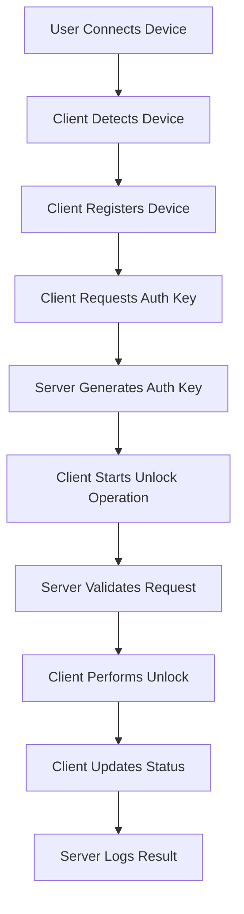

# Xiaomi Device Unlock Workflow

This document describes the complete workflow for unlocking Android devices using the Xiaomi Device Unlock System.

## Overview

The system follows a secure, multi-step process to authenticate, authorize, and perform device unlock operations. Each step includes proper validation, logging, and error handling.

## Architecture Flow



## Detailed Workflow

### Phase 1: Device Connection and Detection

#### Step 1: Device Connection
1. **User Action**: Connect Android device to PC via USB
2. **Device Modes**:
   - **EDL Mode**: Qualcomm Emergency Download Mode
   - **BROM Mode**: MediaTek Boot ROM Mode
   - **Mi Assistant Mode**: Xiaomi's proprietary mode
   - **Fastboot Mode**: Standard Android bootloader mode

#### Step 2: Device Detection
```python
# Client automatically detects connected devices
devices = await client.detect_devices()
```

**Detection Process**:
1. **USB Enumeration**: Scan for known VID/PID combinations
2. **Serial Port Scan**: Check for device-specific serial interfaces
3. **ADB/Fastboot Check**: Query ADB and Fastboot interfaces
4. **Device Identification**: Extract device information

**Detected Information**:
- Serial Number
- Device Model and Manufacturer
- Chipset Type (Qualcomm/MediaTek)
- Operating Mode
- Hardware ID
- Android Version (if available)

### Phase 2: Authentication and Authorization

#### Step 3: Device Registration
```javascript
// Server receives device registration
POST /api/device/register
{
  "deviceId": "unique-device-id",
  "serialNumber": "ABC123456789",
  "chipset": "qualcomm",
  "mode": "edl",
  "manufacturer": "Xiaomi",
  "model": "Redmi Note 12"
}
```

**Registration Process**:
1. **HMAC Validation**: Verify request signature
2. **Device Validation**: Check device information
3. **Database Storage**: Store device record
4. **Response**: Return device ID and status

#### Step 4: Authentication Key Request
```javascript
// Client requests authentication key
POST /api/auth/request-key
{
  "deviceInfo": {
    "deviceId": "unique-device-id",
    "serialNumber": "ABC123456789",
    "chipset": "qualcomm",
    "mode": "edl"
  }
}
```

**Auth Key Generation**:
1. **Device Validation**: Verify device exists and is authorized
2. **JWT Creation**: Generate time-limited JWT token
3. **Bypass Token Generation**: Create device-specific bypass tokens
4. **Response**: Return auth key and bypass tokens

**Bypass Tokens by Mode**:
- **EDL Mode**: Xiaomi EDL bypass tokens
- **BROM Mode**: MediaTek authentication tokens
- **Mi Assistant**: Xiaomi account bypass tokens

### Phase 3: Unlock Operation

#### Step 5: Operation Initiation
```javascript
// Client starts unlock operation
POST /api/unlock/start
{
  "deviceId": "unique-device-id",
  "authKey": "jwt-auth-token",
  "operationType": "frp_unlock"
}
```

**Operation Types**:
- `frp_unlock`: Factory Reset Protection bypass
- `edl_bypass`: EDL authentication bypass
- `bootloader_unlock`: Bootloader unlock
- `mi_unlock`: Mi Account bypass

**Server Validation**:
1. **Auth Key Verification**: Validate JWT token
2. **Device Authorization**: Check device permissions
3. **Operation Creation**: Create operation record
4. **Response**: Return operation ID

#### Step 6: Device Communication

**EDL Mode Unlock**:
```python
async def unlock_edl_device(device, auth_data):
    # 1. Connect to EDL interface
    edl_client = EDLClient(device.connection_path)
    
    # 2. Authenticate with bypass tokens
    bypass_tokens = auth_data['bypassTokens']
    await edl_client.authenticate(bypass_tokens)
    
    # 3. Read partition table
    partitions = await edl_client.read_partitions()
    
    # 4. Patch security verification
    await edl_client.patch_security_checks()
    
    # 5. Unlock bootloader
    await edl_client.unlock_bootloader()
    
    # 6. Bypass FRP protection
    await edl_client.bypass_frp()
    
    # 7. Verify unlock status
    status = await edl_client.verify_unlock()
    return status
```

**BROM Mode Unlock**:
```python
async def unlock_brom_device(device, auth_data):
    # 1. Connect to BROM interface
    brom_client = BROMClient(device.connection_path)
    
    # 2. Authenticate with device key
    device_key = auth_data['bypassTokens']['device_key']
    await brom_client.authenticate(device_key)
    
    # 3. Read preloader
    preloader = await brom_client.read_preloader()
    
    # 4. Patch security verification
    await brom_client.patch_preloader(preloader)
    
    # 5. Upload patched preloader
    await brom_client.upload_preloader(preloader)
    
    # 6. Unlock bootloader
    await brom_client.unlock_bootloader()
    
    # 7. Bypass FRP lock
    await brom_client.bypass_frp()
    
    return True
```

**Mi Assistant Mode Unlock**:
```python
async def unlock_mi_assistant_device(device, auth_data):
    # 1. Connect to Mi Assistant interface
    mi_client = MiAssistantClient(device.connection_path)
    
    # 2. Authenticate with Xiaomi servers
    mi_token = auth_data['bypassTokens']['mi_token']
    await mi_client.authenticate(mi_token)
    
    # 3. Bypass account verification
    await mi_client.bypass_account_verification()
    
    # 4. Request unlock permission
    unlock_token = await mi_client.request_unlock()
    
    # 5. Apply unlock
    await mi_client.apply_unlock(unlock_token)
    
    # 6. Verify status
    status = await mi_client.verify_unlock()
    return status
```

#### Step 7: Progress Updates
```python
# Client sends progress updates
for step in unlock_steps:
    # Update server with current progress
    await api_client.update_operation_status(
        operation_id,
        "in_progress",
        progress=current_progress
    )
    
    # Perform unlock step
    await perform_unlock_step(step)
    current_progress += step_weight
```

#### Step 8: Operation Completion
```javascript
// Final status update
PUT /api/unlock/{operationId}/status
{
  "status": "completed",  // or "failed"
  "progress": 100,
  "errorMessage": null    // or error details if failed
}
```

### Phase 4: Logging and Cleanup

#### Step 9: Operation Logging
**Server automatically logs**:
- Operation start/completion times
- Device information
- Success/failure status
- Error messages and stack traces
- Client information and IP address

**Database Records**:
```sql
INSERT INTO unlock_operations (
    device_id, operation_type, status, 
    started_at, completed_at, client_id, 
    metadata, error_message
) VALUES (...);
```

#### Step 10: Cleanup
1. **Auth Key Expiration**: Keys automatically expire after 5 minutes
2. **Connection Cleanup**: Close device connections
3. **Temporary File Cleanup**: Remove temporary operation files
4. **Memory Cleanup**: Free allocated resources

## Error Handling

### Connection Errors
```python
try:
    result = await device_operation()
except ConnectionError as e:
    logger.error(f"Device connection lost: {e}")
    await api_client.update_operation_status(
        operation_id, "failed", 
        error_message="Device disconnected during operation"
    )
    return False
```

### Authentication Errors
```python
try:
    auth_response = await api_client.request_auth_key(device_info)
except AuthenticationError as e:
    logger.error(f"Authentication failed: {e}")
    cli.error("Failed to authenticate with server")
    return False
```

### Device-Specific Errors
```python
try:
    await edl_client.unlock_bootloader()
except EDLError as e:
    if "partition_locked" in str(e):
        logger.error("Bootloader partition is locked")
        # Attempt alternative unlock method
        await try_alternative_unlock_method()
    else:
        raise  # Re-raise unknown errors
```

## Security Measures

### Request Signing
```python
def generate_hmac_signature(method, path, body, timestamp, client_id, secret):
    data_to_sign = f"{method}{path}{body}{timestamp}{client_id}"
    return hmac.new(
        secret.encode(),
        data_to_sign.encode(),
        hashlib.sha256
    ).hexdigest()
```

### Time-based Validation
```javascript
// Server validates request timestamps
const now = Math.floor(Date.now() / 1000);
const requestTime = parseInt(timestamp);
const timeDiff = Math.abs(now - requestTime);

if (timeDiff > 300) { // 5 minutes
    throw new Error('Request timestamp outside valid window');
}
```

### Auth Key Expiration
```javascript
// JWT tokens expire after 5 minutes
const payload = {
    deviceId: device.deviceId,
    serialNumber: device.serialNumber,
    chipset: device.chipset,
    mode: device.mode,
    timestamp: Date.now()
};

const authKey = jwt.sign(payload, JWT_SECRET, {
    expiresIn: 300, // 5 minutes
    issuer: 'xiaomi-unlock-server',
    audience: 'xiaomi-unlock-client'
});
```

## Monitoring and Alerts

### Operation Monitoring
```python
# Client monitors operation progress
async def monitor_operation(operation_id):
    while True:
        status = await api_client.get_operation_status(operation_id)
        
        if status['status'] in ['completed', 'failed']:
            break
            
        # Check for timeout
        if time.time() - start_time > OPERATION_TIMEOUT:
            await api_client.update_operation_status(
                operation_id, 'failed',
                error_message='Operation timeout'
            )
            break
            
        await asyncio.sleep(5)  # Check every 5 seconds
```

### Health Checks
```javascript
// Server health monitoring
app.get('/health', (req, res) => {
    const health = {
        status: 'OK',
        timestamp: new Date().toISOString(),
        uptime: process.uptime(),
        memory: process.memoryUsage(),
        database: database.isConnected()
    };
    
    res.json(health);
});
```

## Performance Optimization

### Connection Pooling
```javascript
// Database connection pooling
const pool = new Pool({
    host: process.env.DB_HOST,
    port: process.env.DB_PORT,
    database: process.env.DB_NAME,
    user: process.env.DB_USER,
    password: process.env.DB_PASSWORD,
    max: 20,                    // Maximum connections
    idleTimeoutMillis: 30000,   // Close idle connections
    connectionTimeoutMillis: 2000
});
```

### Async Operations
```python
# Parallel device detection
async def detect_all_devices():
    detection_tasks = [
        detect_usb_devices(),
        detect_serial_devices(),
        detect_adb_devices(),
        detect_fastboot_devices()
    ]
    
    results = await asyncio.gather(*detection_tasks, return_exceptions=True)
    return combine_results(results)
```

### Caching
```javascript
// Cache frequently accessed data
const deviceCache = new Map();

async function getDeviceInfo(deviceId) {
    if (deviceCache.has(deviceId)) {
        return deviceCache.get(deviceId);
    }
    
    const device = await database.query('SELECT * FROM devices WHERE device_id = $1', [deviceId]);
    deviceCache.set(deviceId, device);
    
    // Cache expires after 5 minutes
    setTimeout(() => deviceCache.delete(deviceId), 300000);
    
    return device;
}
```

## Best Practices

### Client Side
1. **Always validate device state** before operations
2. **Implement proper timeout handling**
3. **Use connection pooling** for multiple operations
4. **Log all operations** for debugging
5. **Handle network interruptions** gracefully

### Server Side
1. **Validate all input data** thoroughly
2. **Use prepared statements** for database queries
3. **Implement rate limiting** to prevent abuse
4. **Log security events** for monitoring
5. **Use HTTPS** in production environments

### Security
1. **Rotate HMAC secrets** regularly
2. **Monitor for suspicious activity**
3. **Implement request throttling**
4. **Use secure random generators**
5. **Validate timestamps** to prevent replay attacks

## Troubleshooting Guide

### Common Issues

#### Device Not Detected
1. Check USB drivers are installed
2. Verify device is in correct mode
3. Try different USB ports/cables
4. Check device permissions (Linux)

#### Authentication Failures
1. Verify HMAC secrets match
2. Check system time synchronization
3. Validate client ID configuration
4. Review server logs for details

#### Operation Timeouts
1. Check network connectivity
2. Verify device remains connected
3. Review operation complexity
4. Increase timeout values if needed

#### Database Errors
1. Check database connection
2. Verify user permissions
3. Review migration status
4. Check disk space availability

This workflow ensures secure, reliable, and traceable device unlock operations while maintaining compatibility with various Android devices and modes.
